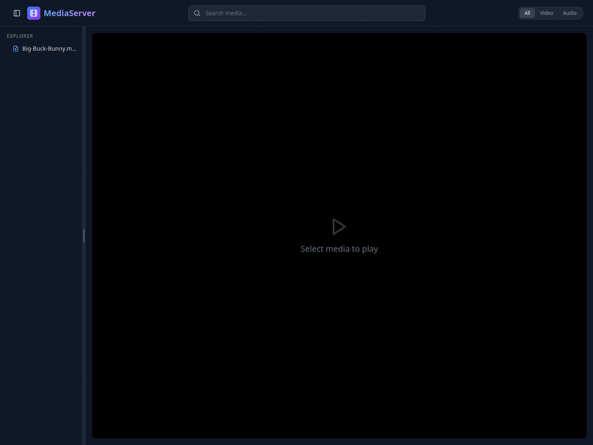
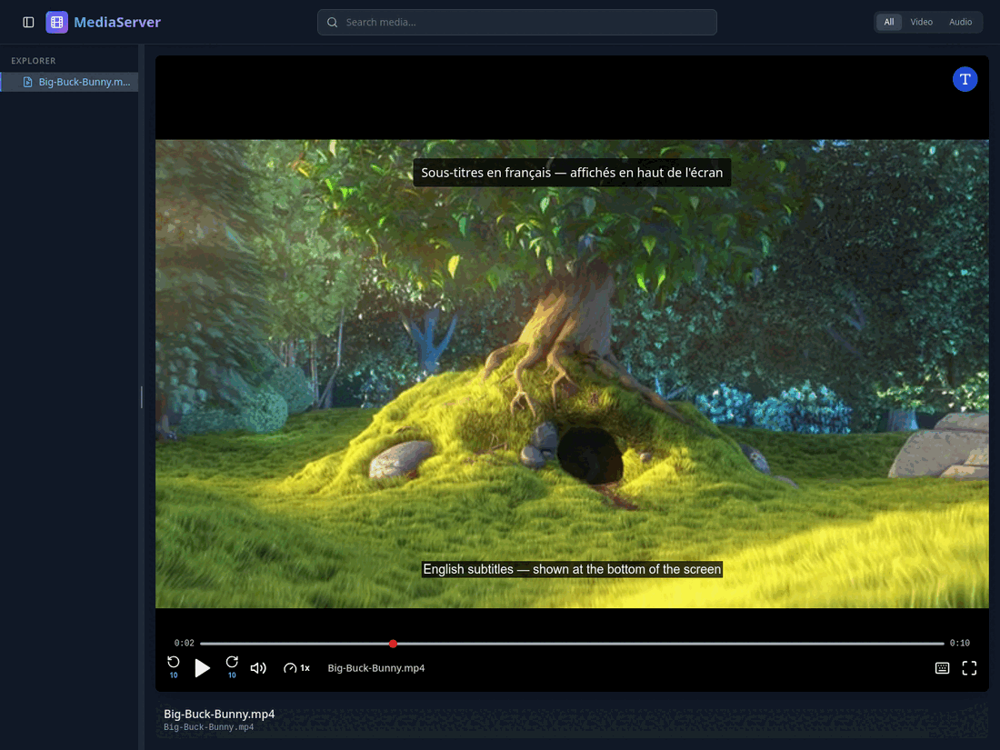
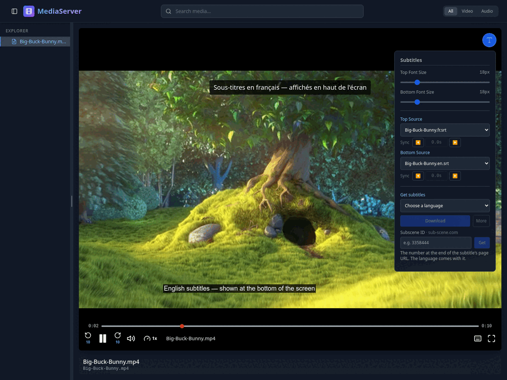
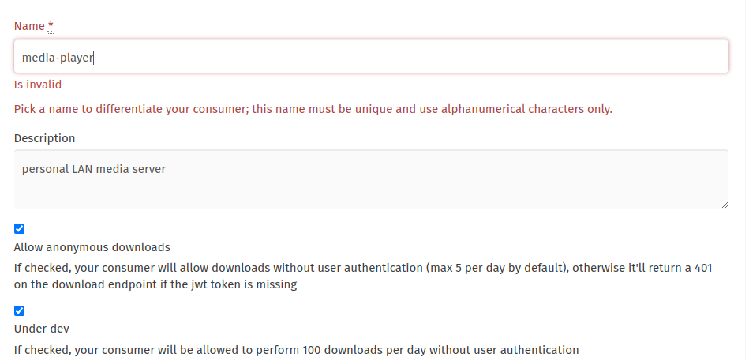

# HomeReel

Stream the videos and music already sitting on your computer to any device on
your home network — your TV, a phone, a tablet — through a web browser. No
accounts, no cloud, no uploading anything.

Point it at a folder, run one command, open the printed link on your TV.

- Browse your media folder as a tree, or search it
- Video and audio playback with keyboard controls
- Subtitles, including `.srt` files (converted on the fly) and dual top/bottom tracks
- Optionally download missing subtitles by language — see [Subtitles](#subtitles)
- Seeking works properly on large files, via HTTP range requests
- Built for old smart-TV browsers, which are usually years behind desktop Chrome

## Screenshots

| Library | Two subtitles at once |
|---|---|
|  |  |

The right-hand shot is *Big Buck Bunny* (Blender Foundation, CC BY 3.0) with a
French subtitle pinned to the top and an English one to the bottom — the
player can show two languages at once, one in each slot. See
[Subtitles](#subtitles) for the panel that sets this up.

## What it does not do

Worth knowing before you install it:

- **No transcoding.** Files are streamed as they are, so your TV's browser has
  to understand the codec itself. MP4 (H.264 + AAC) is the safe bet. Many TVs
  refuse MKV, H.265/HEVC, or DTS audio. If a file lists but will not play, this
  is almost always why.
- **No authentication.** Anyone who can reach your computer on the network can
  browse and play your media. That is fine on a home Wi-Fi network. Do not
  forward this port to the internet.

## Quick start

```bash
git clone https://github.com/prem2017/homereel.git
cd homereel

./0_setup      # asks where your media is, then gets everything ready
./1_run        # starts it
./x_stop       # stops it
```

That is the whole thing. `0_setup` is a one-time step; after that you only ever
need `./1_run` and `./x_stop`.

### What `0_setup` does

1. Asks which folder holds your media, and writes your answer to `.env`
2. Looks for **Docker** or **Node.js 18+**, and uses whichever you have
3. Builds the application

If you have *neither*, it explains what it would install, shows you the exact
commands, and asks for permission first. Answer `n` and it stops without
touching your system. Nothing is ever installed behind your back.

Run it without prompts using `./0_setup --yes`.

### Requirements

You need **one** of these — `0_setup` will offer to install Docker if you have
neither:

- **Docker** — bundles everything, nothing else to install
- **Node.js 18 or newer** ([nodejs.org](https://nodejs.org))

## Starting and stopping

```bash
./1_run                 # start
./x_stop                # stop, whichever way it is running
./1_run logs            # follow the logs            (Docker only)

./1_run --node          # force running with Node.js
./1_run --docker        # force running in Docker
./1_run --port 5050     # use a different port, just this once
```

In Node mode the app runs in your terminal, so leave the window open while you
are watching — `Ctrl+C` stops it. In Docker mode it runs in the background and
survives closing the terminal. Either way `./x_stop` stops it.

When you start it, you will see:

```
  HomeReel is running

  Serving media from : /home/you/Videos
  On this computer   : http://localhost:5000
  On your TV / phone : http://192.168.1.21:5000
```

## Watching on your TV

1. Make sure the TV is on the **same Wi-Fi network** as your computer.
2. Open the TV's web browser.
3. Type in the `On your TV / phone` address printed above — including the
   `:5000` at the end.

Leave the terminal running; closing it stops the server.

If the page will not load, see [Troubleshooting](#troubleshooting).

## Subtitles

Two separate things here, and only the second one needs any setup.



**Subtitle files already sitting next to your videos** just work. Any `.srt` or
`.vtt` in the same folder is listed in the player's subtitle menus, and one
matching the video's name is picked automatically. `.srt` is converted on the
fly. Nothing to configure, no account, no internet.

A `Subs/` folder is read as well — the layout most downloads arrive in:

```
Kantara A Legend Chapter 1 (2025) 1080p WEBRip 5.1-WORLD/
├── Kantara.A.Legend.Chapter.1.2025.1080p.WEBRip.x264.AAC5.1-WORLD.mp4
└── Subs/
    ├── kan.srt
    └── kantara.srt        ← both offered in the menus
```

Any subfolder holding subtitles and no video counts, whatever it is called, and
its subtitles are offered without needing to match the film's name — there is
only one film there for them to belong to. If the folder holds a whole season
instead, names matter again and each episode is offered only its own subtitles,
so episode 1's dialogue can never turn up under episode 5.

**Downloading subtitles you do not have** is optional, and off until you add an
API key. Without one the menus still list your local files exactly as above —
only the "search online" part is missing. Nobody should have to register for
anything to watch a file off their own disk.

With a key, the player's subtitle panel gains a **Get subtitles** section: pick a
language, press **Download**, and the best match is fetched and loaded. Press
**More** instead to see the candidates first and choose one yourself.

Downloading and displaying are two separate steps, which is why there are two
sets of menus:

| Menu | What it does |
|---|---|
| **Get subtitles** | Fetches a subtitle file into the video's folder. |
| **Top Source** / **Bottom Source** | Chooses which file to show, and where. Lists the subtitles belonging to the video you are playing — what you downloaded and what was already there. In a season folder that means this episode's, not the whole series'. |

So you can hold several subtitles for one film and switch between them without
downloading anything again, or put two languages on screen at once — one at the
top, one at the bottom.

**If the first one is a poor match, just press Download again.** It skips past
what you already have and takes the next-best candidate, so you never pay twice
for the same file. The panel lists what is already downloaded in that language,
so you can see what a second press will cost you.

Downloads are saved next to the video like this:

```
OS_Ford-V-Ferrari_1080p_en1.srt
└┬┘ └─────┬──────┘ └─┬─┘ └┬┘└┬┘
 │        │          │    │  └─ how many you have in this language
 │        │          │    └──── language
 │        │          └───────── resolution, when the file name says
 │        └──────────────────── the film
 └───────────────────────────── where it came from (OS, SD, SS)
```

Nothing is ever overwritten, so trying a second subtitle never costs you the
first — and deleting one you did not like is enough to make the app forget it.

### When a subtitle runs early or late

Under each **Source** menu is a **Sync** row:

```
Sync   ◀    +1.5s    ▶
```

`◀` shows the subtitles earlier, `▶` later, half a second at a time. The middle
button is the current shift and resets it. On a keyboard, `g` and `h` do the same
in finer 0.1s steps.

Each subtitle has its own shift, and it is **remembered** — come back to the same
film tomorrow and it is still lined up. Deleting the subtitle or resetting it to
`0.0s` forgets it.

You will mostly need this on subtitles matched by title rather than by file hash.
A hash match was timed against your exact copy and is already in sync; a title
match is a guess about which rip you have, and a guess can be a second or two out.

One thing this cannot fix: a subtitle that starts in sync and drifts further out
as the film goes on. That is a frame-rate mismatch rather than a delay, and no
single shift lines it up. Downloading a different one is the fix.

### Getting an OpenSubtitles key

This is the one worth having. It is the only source that can match on a hash of
the video file itself, which means the subtitle it finds was timed against your
exact copy and will be in sync — rather than being a guess about which rip you
have.

1. **Register at [opensubtitles.com](https://www.opensubtitles.com/en/users/sign_up).**
   Note the `.com` — the older `opensubtitles.org` is a different site with a
   different API, and its keys will not work here.
2. **Confirm the verification email.** The next page stays locked until you do.
3. Go to **[API consumers](https://www.opensubtitles.com/en/consumers)** and
   click **New consumer**.
4. Fill the form as below, then submit. There is no review step — the key is
   issued immediately.



Three things about that form, each of which catches people out:

- **The name must be alphanumeric and unique across the whole site.** The
  screenshot above is showing `Is invalid` for exactly one reason: the hyphen in
  `media-player`. Something like `yournamemediaplayer` clears both rules at once.
  The name has no effect on the app — nothing sends it.
- **"Allow anonymous downloads" must be checked.** This app authenticates with
  the API key alone and never sends a JWT, so with that box unchecked every
  download returns 401. See the Troubleshooting entry below for what that looks
  like, because the symptom is misleading.
- **"Under dev" raises the anonymous limit from 5 downloads a day to 100.** Five
  is barely two films with one retry. This flag is intended for consumers still
  in development; a personal player on your own network is a reasonable fit, but
  it is their flag and they can reset it.

Copy the key from the consumers page into `.env`:

```bash
OPENSUBTITLES_API_KEY=your_key_here
```

Then restart with `./1_run`. A restart is required — reloading the browser page
will not pick up a new key, and under Docker the container only reads `.env` when
it starts.

### Getting a SubDL key

Optional, and genuinely optional — skip it unless you want a backup.

Register at [subdl.com](https://subdl.com/panel/signup), then find the key in
your account panel (their [API docs](https://subdl.com/api-doc) point at the
current location if the menu has moved).

It cannot match on file hash, so it will never beat OpenSubtitles on quality, but
it has its own separate daily allowance:

```bash
SUBDL_API_KEY=your_key_here
```

### More than one person in the house

The daily download limit is per account. If several people each register their
own key, put them all in one setting separated by commas and the allowances add
up:

```bash
OPENSUBTITLES_API_KEY=alicekey,bobkey,carolkey
```

The app moves to the next key when one runs out, and back to the first when the
provider's counter resets. Searching is free and unmetered, so it keeps working
from any key even when every download has been used for the day.

With **Under dev** checked you already have 100 downloads a day from a single
key, which is more than a household is likely to watch — so treat this as a
backstop rather than something to organise on day one.

### Subscene (optional, no account)

A third source, and a different shape from the other two: **there is nothing to
register for, but the app cannot search it.** You find the subtitle on the site
yourself and give the player its ID.

The site's search page is behind a Cloudflare bot check. Getting past that means
pretending not to be a program, which this project does not do — so the half that
is open (fetching a subtitle by ID, which the site allows) is the half that is
built.

**Setting it up: nothing to do.** The address ships in `.env.example` and works
as it stands:

```bash
SUBSCENE_URL=https://sub-scene.com
```

It is a setting rather than something built in for a reason: the original
`subscene.com` shut down in May 2024, and the site answering today is a clone
under different ownership. If it moves again, change this one line — no code
change, no update needed. If the box tells you the address is not answering,
that is what has happened: find a working one and put it here.

**This line is the whole of its configuration.** Subscene is a source of its own
and has nothing to do with `SUBTITLE_PROVIDERS` — the app cannot search it, so it
never competes with OpenSubtitles or subdl and there is no ordering for it to be
part of. Set the address and the ID box works; blank it and the box is switched
off and says so. Nothing else affects it, and it works on its own with no API key
for anything else.

> Renamed from `SUBSCENE_BASE_URL`. The old name still works if you are running
> outside Docker, with a note in the log asking you to rename it.

**Using it.** Find your subtitle on the site in an ordinary browser and take the
number off the end of its URL:

```
https://sub-scene.com/subtitle/3358444
                               ^^^^^^^ this is the ID
```

In the player's subtitle panel, paste the ID into the **Subscene ID** box (see
the screenshot above). From the fifth character on, the app asks the site
whether that ID is real, and tells you what it found:

| The box is | It means |
|---|---|
| red | Not an ID — a pasted whole URL is the usual slip — or still too short |
| amber | Asking the site |
| **green** | There is a subtitle there. The line underneath names it, and **Get** lights up blue |
| red, with a reason | The site answered and has nothing to download at that ID |
| amber, with a reason | The address itself is not answering — the site has moved again, so find a working one and set `SUBSCENE_URL` |
| greyed out | `SUBSCENE_URL` is empty. Set it and restart |

That last one is worth having: some old IDs still have a page but no file behind
it any more, and without the check they look fine right up until the download
fails. The label above the box shows which site is being asked, so you can see it
matches the one you copied the ID from.

Press **Get**. The app downloads it, unzips it if it arrives as an archive, and
saves it next to your video named like any other download, with `SS` for the
source:

```
SS_Ford-V-Ferrari_1080p_en1.srt
```

It then appears in both the **Top** and **Bottom** subtitle menus, the same as a
subtitle that was already in the folder.

**You do not need to pick a language for this.** The ID names one particular file
on the site, and the site says what language it is — so that is what the app
reads, and what the saved file is named after. If a language is selected and the
subtitle turns out to be something else, the panel says so and the file keeps its
real language.

**One ID is often a whole season.** Subscene packs all of a season's episodes
into one archive, and the app handles that the way you would want:

- the episode you are **watching** is the one that gets selected — matched by
  `S01E05` in the names, not by the order inside the ZIP;
- every other episode in the pack that has a **video file in the same folder**
  gets its subtitle saved too, so one ID subtitles the season and episode 6 is
  ready when you reach it;
- if the archive turns out not to contain the episode playing, nothing is saved
  and it tells you what the archive does hold.

> The download link is read out of the page, so the app only accepts one pointing
> at the site itself or at its known archive host, `res.subscene.best`.

## Docker

If Docker is what you have, `0_setup` picks it automatically and `./1_run` starts
the container — no Node.js needed on your machine, since everything builds
inside the image.

Your media folder is mounted writable, because a downloaded subtitle is saved
next to the video it belongs to. Nothing else is ever written: the app only
creates `.srt` and `.vtt` files, only under names it derives from the video
itself, and it never overwrites a file that already exists. If you would rather
it could not write at all, add `:ro` to the media volume in `docker/compose.yml`
and skip [subtitle downloading](#subtitles) — everything else works unchanged.

To switch an existing install between the two, edit `RUN_MODE` in `.env`, or
override it for a single run with `./1_run --docker` / `./1_run --node`.

## Development

```bash
./scripts/run-dev
```

Runs the API and the interface as two processes with live reload: edit a React
component and the browser updates instantly; edit the server and it restarts by
itself. Open the **Network** URL that Vite prints — it is reachable from your TV
too, so you can test on the real device as you work.

Press `Ctrl+C` once to stop both.

Other commands:

```bash
npm run build       # build the frontend into web/dist
npm run typecheck   # type-check without emitting
npm test            # both test suites (needs Node 20.19+ or 22.12+)
npm run serve       # run the server alone, against an existing build
```

## Configuration

All settings live in `.env` (copied from `.env.example`, and git-ignored so
your paths stay private).

| Setting | Default | What it does |
| --- | --- | --- |
| `MEDIA_DIR` | — | **Required.** Folder holding your media. Scanned recursively. Written to only when you download a subtitle, which is saved next to the video. |
| `PORT` | `5000` | Port the app listens on. |
| `RUN_MODE` | set by `0_setup` | `docker` or `node` — how `./1_run` starts the app. |
| `WEB_DEV_PORT` | `5173` | Vite dev-server port. Only used by `run-dev`. |
| `OPENSUBTITLES_API_KEY` | empty | Enables subtitle downloading. Comma-separated for several keys. See [Subtitles](#subtitles). |
| `SUBDL_API_KEY` | empty | Optional second source. Also comma-separated. |
| `SUBTITLE_LANGUAGES` | `en,fr,es,hi,ja,it,ko,de,pt,ar` | Languages the subtitle menus offer, in order. |
| `SUBSCENE_URL` | `https://sub-scene.com` | Where to fetch a Subscene subtitle by ID from, and the only setting that affects it. A setting rather than a constant because the site is a clone that has moved before. Empty turns the ID box off. Was `SUBSCENE_BASE_URL`. See [Subtitles](#subtitles). |
| `SUBTITLE_PROVIDERS` | `opensubtitles,subdl` | Which sources to **search**, and your order of preference. The order only breaks ties between equally good matches — a subtitle matched by file hash always wins. Subscene is not one of these: it has no search, so it is not on this line and is unaffected by it. |

Any value can be overridden for a single run — `PORT=8080 ./1_run`, or for the
port specifically, `./1_run --port 8080`.

Re-run `./0_setup` any time to change your answers.

## Project structure

```
homereel/
├── 0_setup               one-time setup
├── 1_run                 start the app
├── x_stop                stop it, either runtime
├── web/                  React + TypeScript interface
│   ├── src/
│   │   ├── components/   FileTree, Header, MediaPlayer, ErrorBoundary
│   │   ├── services/     API client
│   │   ├── utils/        subtitle parsing, time formatting
│   │   └── main.tsx      entry point
│   ├── index.html
│   └── vite.config.ts    build + dev proxy config
├── server/               Express API and static file server
│   ├── index.js          file scanning, search, range streaming
│   ├── mediaPath.js      the path-containment guard - see Security
│   └── subtitles/        search, download, and archive handling
├── docker/               Container build
│   ├── Dockerfile
│   └── compose.yml
├── scripts/              implementations that 0_setup and 1_run call
│   ├── run               the Node.js path
│   ├── run-dev           development, with live reload
│   ├── run-docker        the Docker path
│   └── lib.sh            shared helpers
└── .env.example          configuration template
```

In production the Express server serves both the API and the built interface on
a single port. In development Vite serves the interface and proxies `/api` to
Express.

## Troubleshooting

**The TV cannot open the page.**
Check the obvious one first — the TV and the computer must be on the same
network. Guest Wi-Fi and 5 GHz/2.4 GHz split networks often isolate devices
from each other. Then check your firewall, which is the usual culprit:

```bash
sudo ufw allow 5000/tcp          # Linux, if you use ufw
```

On macOS, System Settings → Network → Firewall → Options, and allow incoming
connections for Node.

**A file shows in the list but will not play.**
Your TV's browser cannot decode it. See [What it does not do](#what-it-does-not-do).
Test the same file in your desktop browser: if it plays there but not on the TV,
it is a codec limitation on the TV, not a bug here.

**`MEDIA_DIR points at a folder that does not exist`.**
Re-run `./0_setup`, or edit `.env` directly. The path must be absolute
(`/home/you/Videos`, not `~/Videos`).

**`Port 5000 is already in use`.**
The message names what is holding the port and suggests a free one. The usual
cause is the Docker copy already running — `./x_stop` first, or use another port.
On macOS, port 5000 is taken by AirPlay Receiver; either turn it off in System
Settings, or pick another port.

```bash
./1_run --port 5050          # just this once
```

Set `PORT` in `.env` to change the default.

**`permission denied` talking to Docker.**
Your user is not in the `docker` group yet. `sudo usermod -aG docker $USER`,
then log out and back in — opening a new terminal is not enough, because group
membership is only picked up at login.

**`container name "/homereel" is already in use`.**
A container left behind by an older version is holding the name. `./1_run` spots
this and offers to remove it for you — answer `y`. It carries no data, so
nothing is lost. To do it by hand: `docker rm -f homereel`, then `./1_run`.

**Nothing appears in the sidebar.**
Only video and audio files are listed; everything else, including subtitle
files, is hidden from the browser (they still work — see [Subtitles](#subtitles)).
Hidden files and folders starting with `.` are skipped too.

**Subtitle search finds results, but downloading always fails.**
Almost certainly the **Allow anonymous downloads** box on your OpenSubtitles
consumer. Searching needs only the API key, so the candidate list looks perfectly
healthy; downloading is the part that returns 401 without it. Edit the consumer
at [opensubtitles.com/en/consumers](https://www.opensubtitles.com/en/consumers),
tick the box, and restart with `./1_run`. You can check the key directly:

```bash
curl -s -H "Api-Key: YOUR_KEY" -H "User-Agent: media-player v1.0.0" \
  -H "Content-Type: application/json" -d '{"file_id":1}' \
  https://api.opensubtitles.com/api/v1/download
```

A reply containing `link` and `remaining` means anonymous downloads are on. A 401
means they are not.

**Subtitle downloads stop working part-way through the day.**
You have used the daily allowance — 100 downloads with **Under dev** checked, 5
without. The count shown under the language menus is what is left. Searching
carries on working regardless, so you can still see what is on offer and add a
file by hand.

## Security

The server only ever serves files from inside `MEDIA_DIR`. Requested paths are
resolved and checked for containment before anything is read, so `..` sequences
and absolute paths cannot escape that folder.

Subtitle downloading is the one feature that writes to `MEDIA_DIR`, and it is
deliberately narrow: the filename is derived from your video rather than from
anything the provider sent, only `.srt` and `.vtt` are ever created, an existing
file is never overwritten, and the downloaded bytes have to prove they contain
subtitle timings before they are saved — so a provider link that quietly redirects
to an ad page ends up rejected instead of next to your films.

There is no login, though. Treat it as visible to everyone on your network, and
do not expose the port to the internet.

## License

MIT
