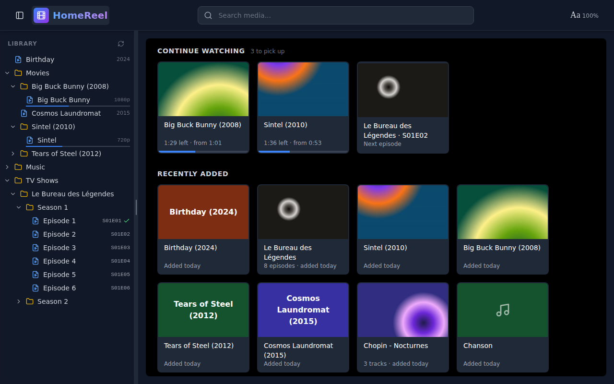

# HomeReel

Stream the videos and music already on your computer to any device on your home
network — your TV, a phone, a tablet — through its web browser. No accounts, no
cloud, no uploading.



- Your folders as a library with readable names, a Home screen, and search
- Picks up where you stopped, and carries on to the next episode
- Subtitles from your folders, two languages at once, and optional downloads
- Made for old smart-TV browsers, and works on phones too

## Quick start

You need **Docker** or **Node.js 18+**. If you have neither, `0_setup` offers to
install Docker, and asks first.

```bash
git clone https://github.com/prem2017/homereel.git
cd homereel

./0_setup      # asks where your media is, then builds everything
./1_run        # starts it, and prints the address to open
./x_stop       # stops it
```

On the TV, open the web browser and type the address printed under
*On your TV / phone*, for example `http://192.168.1.21:5000`. The TV has to be on
the same Wi-Fi as the computer.

## Good to know

- **No transcoding.** Files play as they are, so the TV's browser has to support
  them. MP4 (H.264 + AAC) is the safe choice; many TVs refuse MKV and HEVC.
- **No login.** Anyone on your network can browse and play. Do not expose the
  port to the internet.
- **Downloading subtitles is optional** — searching for them needs a free API key.

## More

**[README_EXT.md](README_EXT.md)** has everything else: a tour with screenshots,
the remote and keyboard controls, subtitles and how to get a key, every setting,
Docker, development, and troubleshooting.

## License

MIT
